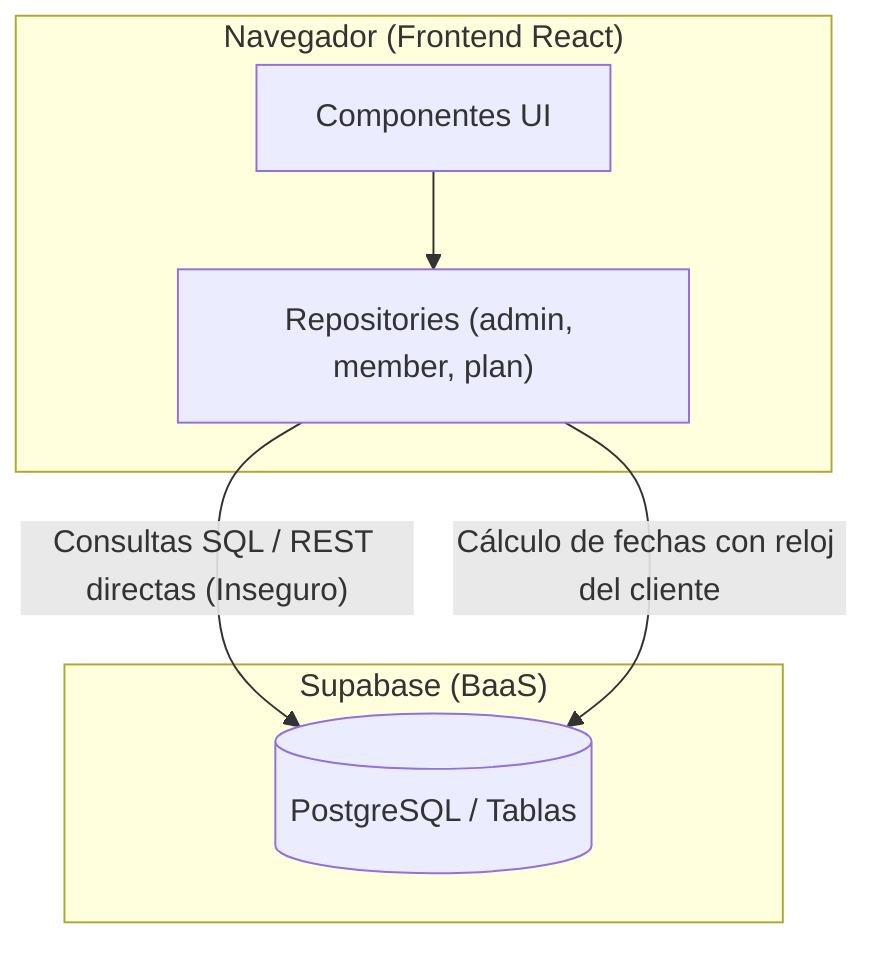
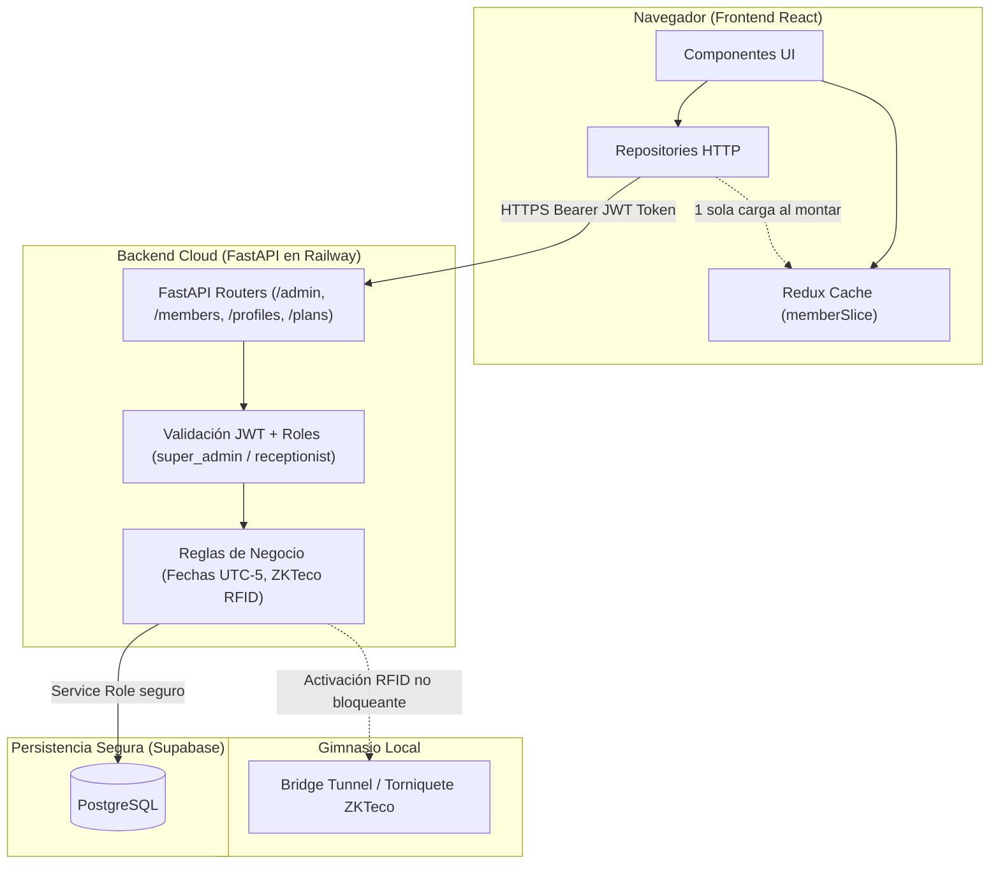

# Resumen de Migración: De Supabase Directo a Railway (Backend Cloud)

> **Fecha:** Septiembre 2026  
> **Alcance:** Migración completa de consultas de negocio de frontend (`member`, `plan`, `profile`, `admin`) hacia el backend FastAPI en Railway.  
> **Estado:** Implementado, verificado y commiteado en rama `develop`.  

---

## 1. La Metáfora: ¿Por qué hicimos este cambio?

Imagina un **restaurante**:
* El **Frontend** (el navegador web) son los **clientes sentados a las mesas**.
* La **Base de Datos (Supabase)** es la **despensa con todos los ingredientes y la caja fuerte**.
* El **Backend Cloud (Railway / FastAPI)** es el **chef ejecutivo y el cajero experto**.

### El Problema (Antes)
Antes de esta sesión, el restaurante funcionaba de una forma muy peligrosa:  
**Los clientes se levantaban de su mesa, entraban directo a la despensa a servirse la comida y abrían la caja fuerte para registrar ellos mismos cuánto pagaban.**

* ¿Qué podía salir mal?
  1. **Seguridad frágil:** Si un cliente curioso abría las herramientas de desarrollador del navegador (F12), podía ver consultas directas a las tablas y tratar de manipularlas.
  2. **Reglas de negocio rotas:** Si un cliente registraba un pago mensual, su propio navegador calculaba cuándo vencía su membresía. Si el reloj de su computadora estaba atrasado un mes, ¡el gimnasio le regalaba un mes gratis sin darse cuenta!
  3. **Desorden y lentitud:** En el portal de miembros, 4 componentes distintos se levantaban al mismo tiempo a pedir la misma información a la despensa, saturando la cocina de pedidos repetidos.
  4. **Pérdida de atomicidad:** Para actualizar a un miembro, el frontend hacía dos llamadas separadas (una a `members` y otra a `profiles`). Si la red fallaba a la mitad, los datos quedaban corruptos.

### La Solución (Ahora)
Ahora el restaurante funciona con **Arquitectura de 3 Capas (3-Tier)**:
1. El cliente pide al mesero lo que necesita (`HTTP GET /members/me`).
2. El chef (FastAPI en Railway) valida quién es el cliente, comprueba sus permisos, calcula las fechas con la hora oficial de Colombia (`America/Bogota UTC-5`), prepara la respuesta y actualiza la despensa de forma segura.
3. El cliente solo recibe su plato listo para disfrutar, sin tocar jamás la despensa.

---

## 2. Diagrama de Flujo: Antes vs. Después

### Antes (Inseguro y Acoplado)

### Después (Arquitectura Hexagonal Robusta)

---

## 3. Desglose Fase por Fase: ¿Qué se cambió, por qué y cómo?

### Fase 1: `member.repository.ts` y Eliminación de Cascadas con Redux

#### El Dolor
Al entrar al portal del miembro, `MemberLayout.tsx` tenía un `useEffect` que dependía de `[profile, location.pathname]`. Cada vez que el usuario hacía clic en una pestaña ("Renovación", "Pagos", "Sugerencias"), `location.pathname` cambiaba y se volvía a pedir el miembro. Además, los componentes hijos volvían a ejecutar sus propios `useEffect` disparando hasta 5 peticiones simultáneas a la base de datos para el mismo usuario.

#### Lo que hicimos
1. **Backend (`backend-cloud/src/routers/members.py`):**
   * Creados los endpoints:
     * `GET /members/me`: Obtiene el miembro y perfil a partir del JWT.
     * `GET /members/me/day-passes`: Obtiene tiqueteras activas.
     * `GET /members/me/payments`: Historial de pagos personal.
     * `POST /members/me/suggestions`: Envío de sugerencias.
2. **Frontend (`memberSlice.ts` en Redux):**
   * Creamos un slice en Redux con `{ member, dayPass, isLoading, error }`.
   * En `MemberLayout.tsx`, cambiamos la dependencia a `[profile?.id]`. Se consulta `/members/me` **una única vez** al iniciar sesión.
   * `MemberPortal`, `MemberRenewal`, `MemberPayments` y `MemberSuggestions` ahora leen del store central vía `useSelector` sin hacer ningún fetch redundante.

---

### Fase 2: `plan.repository.ts` — Consulta de Planes

#### El Dolor
Para mostrar los planes de suscripción, el cliente hacía un `supabase.from('plans').select(...)`. Esto impedía cachear los planes en el backend o filtrar planes según reglas comerciales futuras.

#### Lo que hicimos
1. **Backend (`src/routers/plans.py`):**
   * Endpoint `GET /plans` que retorna los planes activos ordenados por precio ascendente.
2. **Frontend (`plan.repository.ts`):**
   * `getActivePlans()` ahora hace `fetch(`${apiUrl}/plans`)`.

---

### Fase 3: `profile.repository.ts` — Datos del Usuario

#### El Dolor
La lectura y modificación del perfil (`full_name`, `phone`) se hacía directo en la tabla `profiles` desde el navegador.

#### Lo que hicimos
1. **Backend (`src/routers/profiles.py`):**
   * `GET /profiles/me`: Extrae el ID autenticado desde el token y retorna el perfil.
   * `PUT /profiles/me`: Actualiza de forma segura únicamente los campos permitidos.
2. **Frontend (`profile.repository.ts`):**
   * Actualizado para consumir los endpoints `/profiles/me`.

---

### Fase 4: Tolerancia a Fallos en `assign-chip` (Torniquete ZKTeco)

#### El Dolor
Cuando recepción intentaba asignarle una tarjeta RFID o manilla a un socio mediante `POST /admin/assign-chip`, si el túnel local hacia el gimnasio (Bridge) estaba caído por microcortes de internet, el backend lanzaba un error **HTTP 500**. Esto bloqueaba al recepcionista y le impedía continuar.

#### Lo que hicimos
* En `backend-cloud/src/api/routes/admin.py`:
  * Si la conexión con el Bridge de ZKTeco falla o da timeout, **no lanzamos error 500**.
  * Guardamos el comando `activate` en la tabla `pending_commands`.
  * Actualizamos el `card_no` en la tabla `members`.
  * Retornamos status exitoso con advertencia: `{"status": "queued", "found_in_zkteco": False}`.
  * Cuando el Bridge vuelva a estar en línea, procesará la cola automáticamente.

---

### Fase 5: `admin.repository.ts` — El Núcleo de Gestión de Miembros y Pagos

Esta fue la migración más profunda y crítica del sistema:

| Método en Frontend | Endpoint en Railway | ¿Qué hace el Backend? |
|---|---|---|
| `getMembers(withoutChip?)` | `GET /admin/members?without_chip=...` | Valida rol admin/recepcionista. Trae miembros con perfiles embebidos y filtro opcional por chip. |
| `getPayments()` | `GET /admin/payments` | Historial general de pagos con join a `members` y `profiles` ordenado cronológicamente. |
| `getMemberDetail(id)` | `GET /admin/members/{id}` | En una sola llamada devuelve: el miembro con su perfil, su historial completo de pagos y su tiquetera activa (`dayPass`). |
| `getMemberWithProfile(id)` | `GET /admin/members/{id}` | Reutiliza el detalle para devolver el miembro tipado. |
| `updateMember(id, data)` | `PUT /admin/members/{id}` | **Transacción atómica:** actualiza campos en `members` (`status`, `plan`, `end_date`, `card_no`) y en `profiles` (`full_name`, `email`, `phone`) juntos. |
| `suspendMember(id)` | `PUT /admin/members/{id}/suspend` | Suspende la membresía y actualiza la marca de tiempo `updated_at`. |
| `registerManualPayment(data)` | `POST /admin/members/{id}/payments` | **Lógica de negocio server-side completa** (ver detalle abajo). |

#### 🔍 El Cerebro del Registro de Pagos (`POST /admin/members/{id}/payments`)
Antes, el navegador calculaba los días del plan, creaba el pago, actualizaba el miembro y creaba la tiquetera. Si el internet fallaba a mitad, la base de datos quedaba inconsistente.  
Ahora, el backend hace todo en un flujo blindado:
1. **Verificación de Rol:** Solo recepcionistas o super administradores autenticados pueden registrar pagos.
2. **Cálculo de Vigencia:**
   * Consulta la duración real del plan en la tabla `plans`.
   * Si la membresía actual ya está activa y vence a futuro, suma los nuevos días a partir de la fecha de vencimiento actual (renovación anticipada). Si ya expiró, arranca desde hoy.
   * **Zona Horaria Estricta:** Se calculan las fechas con `UTC-5 (Bogotá)`, evitando desfases de día.
3. **Registro de Pago:** Inserta en `payments` con estado `confirmed`.
4. **Activación de Miembro:** Cambia el estado a `active`, asigna el nuevo plan y la nueva fecha de vencimiento.
5. **Manejo de Tiqueteras (Plan 15 Días):** Si el plan es de tiquetera, cierra pases anteriores (`status = 'exhausted'`) y crea un nuevo `member_day_passes` de 15 días con vigencia de 30 días.
6. **Reactivación de Acceso Físico (RFID):** Si el miembro tiene chip asignado, dispara en segundo plano la reactivación en el software de control de acceso ZKTeco sin demorar la respuesta al recepcionista.

### Fase 6: `plans`, `gym_config`, `plan_group_pricing` y `communications`

Con esta fase, **el 100% de las consultas de datos en `admin.repository.ts` quedaron migradas a Railway**.

| Recurso | Métodos Migrados | Endpoint Railway | Nivel de Permiso (Grants) |
|---|---|---|---|
| **Planes Administrativos** | `getPlans()`, `createPlan()`, `updatePlan()` | `GET /admin/plans` `POST /admin/plans` `PUT /admin/plans/{id}` | Lectura: `super_admin`, `receptionist`. Escritura/Mutación: Solo `super_admin`. |
| **Configuración Gimnasio** | `getGymConfig()`, `updateGymConfig()` | `GET /gym/config` `PUT /gym/config` | Lectura: Pública (usada en portal de miembros). Escritura/Mutación: Solo `super_admin`. |
| **Precios Grupales** | `getGroupPricing()`, `createGroupPricing()`, `updateGroupPricing()` | `GET /admin/group-pricing` `POST /admin/group-pricing` `PUT /admin/group-pricing/{id}` | Lectura: `super_admin`, `receptionist`. Escritura/Mutación: Solo `super_admin`. |
| **Comunicaciones** | `getCommunications()`, `sendCommunication()` | `GET /admin/communications` `POST /admin/send-communication` | Lectura: `super_admin`, `receptionist`. Envío masivo: `super_admin`, `receptionist`. |

#### 🛡️ Modelo de Grants y Permisos en Backend / Supabase
1. **Anon / Público:** Solo `GET /gym/config` y endpoints de health check.
2. **Member:** Acceso restringido exclusivamente a su información personal (`/members/me`, `/profiles/me`).
3. **Receptionist:** Acceso de lectura y registro operativo (`/admin/members`, `/admin/payments`, `/admin/plans` en lectura, `/admin/group-pricing` en lectura, `/admin/communications`).
4. **Super Admin:** Privilegios de mutación sobre configuración global del gimnasio (`PUT /gym/config`), creación y edición de planes (`POST/PUT /admin/plans`) y matriz de precios corporativos (`POST/PUT /admin/group-pricing`).
5. **Backend Service Role:** La conexión entre Railway y Supabase se realiza mediante `SUPABASE_SERVICE_ROLE_KEY`, garantizando que ninguna política RLS sea evadida por manipulación desde el cliente navegador.

---

## 4. Matriz de Cumplimiento de Estándares

| Estándar (`specs/`) | Cumplimiento Aplicado |
|---|---|
| **SOLID — SRP (Responsabilidad Única)** | El frontend solo renderiza UI; los repositories solo hacen transporte HTTP; el backend orquesta reglas de negocio y Supabase solo persiste datos. |
| **SOLID — SoC (Separación de Capas)** | Ni un solo componente React consulta Supabase directamente para datos de negocio. Todo pasa por la capa de API. |
| **DRY (Don't Repeat Yourself)** | Redux cachea los datos del miembro en `memberSlice`; `getMemberWithProfile` reutiliza `getMemberDetail`. |
| **Manejo de Errores** | Todos los endpoints de FastAPI retornan códigos HTTP estándar (`401`, `403`, `404`, `500`) con detalles explicativos claros. |
| **Zona Horaria Oficial** | Todas las operaciones de fecha usan `timezone(timedelta(hours=-5))` (Bogotá, Colombia). |
| **Tipado Estricto TypeScript** | Compilación verificada con `tsc -b` y Vite build con **0 errores**. |

---

## 5. Historial de Commits de la Sesión

1. `refactor(member): migrar queries Supabase directo a Railway + Redux slice para member data`
2. `refactor(plans): migrar getActivePlans de Supabase directo a Railway`
3. `refactor(profile): migrar queries de profiles a Railway`
4. `fix(admin): assign-chip encola comando en pending_commands cuando el bridge no responde`
5. `refactor(admin): migrar queries Supabase directo a Railway — members, payments, member detail`
6. `refactor(admin): migrar queries Supabase directo a Railway — plans, gym_config, group_pricing, communications`

> **Rama activa:** `develop` (Todo el código ha sido verificado localmente y subido únicamente a `develop`, protegiendo la rama `main`).

